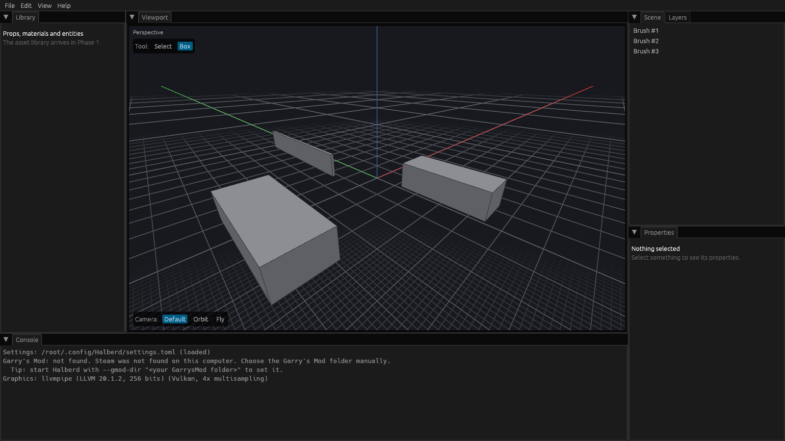
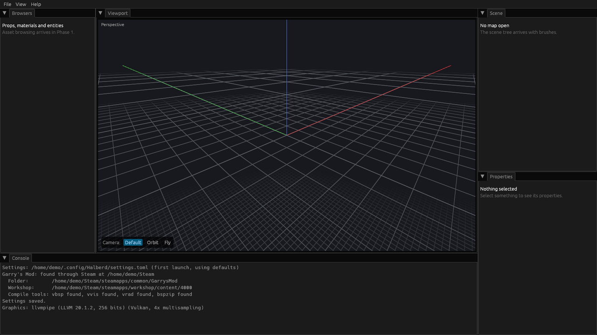
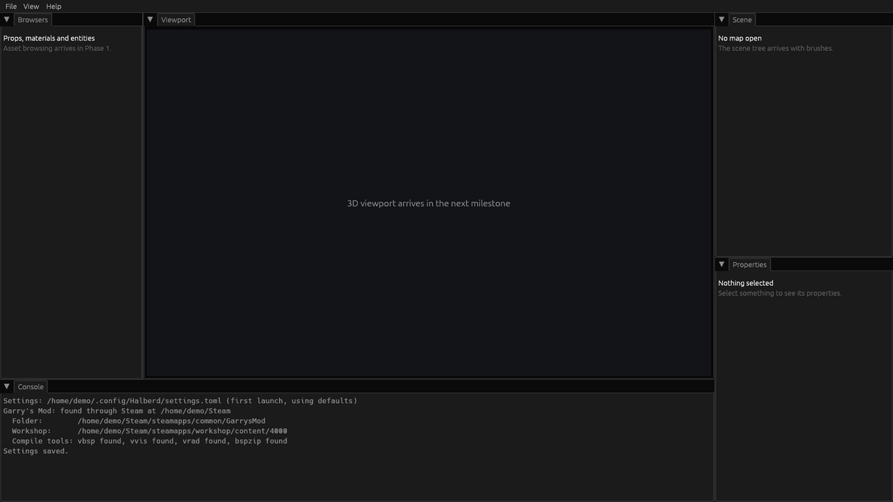

# Halberd Map Editor

**A modern map editor for Garry's Mod.**

Halberd is a free, open-source level editor in the spirit of Unity and Godot: place and shape geometry in a 3D viewport, populate it with props, and compile it straight into a playable GMod map with Valve's own tools. Maps open in Hammer and Hammer++ too, through Export to Hammer.

> **Status: pre-alpha.** You can draw, select and delete box brushes in the 3D viewport, with undo and redo, but maps cannot be saved yet. Follow the progress tracker below.

Created by **Rhyslos**, built with AI assistance (Claude by Anthropic).

## Progress tracker

Halberd is built in four phases. Each ends with a gate that must pass in real GMod before the next phase starts. This tracker is updated by the pull request that finishes each milestone.

### Phase 0 · Foundations (v0.0, internal) — 10 of 13

`██████████░░░` 77%

- [x] Repository set up: license, README, security policy, contribution rules
- [x] Automatic builds for Windows, Linux and macOS on every change
- [x] Quality checks in CI: formatting, lint, tests, license and vulnerability scans
- [x] Documentation setup: architecture, contributing guide, changelog, pull request template, API reference
- [x] Workspace split into crates
- [x] Settings file and GMod install detection
- [x] Window and docking panels (Library, Scene, Layers, Properties, Console)
- [x] 3D viewport with Default, Orbit and Fly camera modes
- [x] Map document with undo and redo for every edit
- [x] Box brushes: draw, select with left click, delete
- [ ] Gizmo modes W / R / S / T: move, rotate, scale and resize brushes
- [ ] VMF import and export of brushes and entities
- [ ] Console panel showing logs and errors

**Gate:** a Hammer-made VMF opens, shows correctly, and re-saves with nothing lost.

### Phase 1 · Blockout (v0.1, public alpha) — 0 of 18

`░░░░░░░░░░░░░` 0%

<details>
<summary>Milestones</summary>

- [ ] Primitives: wedge, cylinder, cone, sphere, arch, stairs
- [ ] Face, edge and vertex selection modes
- [ ] Shape operations: extrude, bevel, join, split, bridge, clip, mirror
- [ ] Boolean operations: union, subtract, intersect
- [ ] Automatic convex splitting on save and export
- [ ] Up to 6 viewports with preset layouts and all six side views
- [ ] Render modes: wireframe, flat, textured
- [ ] Read GMod and HL2 content from VPK archives
- [ ] Material browser and per-face materials
- [ ] Prop browser with real model rendering
- [ ] Basic entities: spawn points, lights, sun, sky
- [ ] GMod scale tools: player reference, clearance checks, unit readout
- [ ] Map sizer and engine limit meters
- [ ] Quick-test compile, then launch GMod
- [ ] Leak detection with a visual leak path
- [ ] Settings page: key bindings, WASD toggle, camera speeds, memory budget
- [ ] Keybinds viewer: a visual keyboard showing every bound key, with hover and search
- [ ] Signed Windows release and first public announcement

</details>

**Gate:** a blockout map built only in Halberd compiles, loads in GMod, and is walkable at the correct scale.

### Phase 2 · Production (v0.5, beta) — 0 of 14

`░░░░░░░░░░░░░` 0%

<details>
<summary>Milestones</summary>

- [ ] Full entity list from GMod's FGD files, with keyvalue editing
- [ ] Entity inputs and outputs with a visual connection view
- [ ] Displacements: create, sculpt, paint blend textures
- [ ] Lighting preview toggle
- [ ] Compile profiles: geometry only, quick test, final
- [ ] Incremental compiles
- [ ] Auto func_detail and nodraw suggestions
- [ ] Workshop and mounted-game content indexing
- [ ] Dependency report before compile
- [ ] Radial menus on Q
- [ ] Groups, prefabs and layers (saved to Hammer as visgroups)
- [ ] Autosave and crash recovery
- [ ] Halberd project file format with versioned migrations
- [ ] Backdoor entity warnings (lua_run, point_servercommand)

</details>

**Gate:** a detailed, lit map with working entity logic plays well in GMod, and a quick-test compile of a medium map takes under 30 seconds.

### Phase 3 · Finishing (v1.0, release) — 0 of 10

`░░░░░░░░░░░░░` 0%

<details>
<summary>Milestones</summary>

- [ ] Decals and overlays
- [ ] Instances
- [ ] Cubemaps
- [ ] Areaportals, hint and skip brushes
- [ ] Automatic optimisation pass before final compile
- [ ] Packing custom and Workshop assets into the map
- [ ] Lossless VMF round trip for every supported Hammer feature
- [ ] Final compile profile with full-quality lighting
- [ ] Performance pass against the budgets
- [ ] User manual and getting-started tutorial

</details>

**Gate:** a release-quality map is made without Hammer, published on the Workshop, and played on a public server.

### History

Newest first. One line per finished milestone or passed gate.

| Date | Event |
| --- | --- |
| 2026-10-08 | First brushes: draw boxes, select them, delete them, with undo and redo |
| 2026-10-08 | First 3D viewport: grid, axes, and the Default, Orbit and Fly camera modes |
| 2026-10-07 | First real window: menu bar and five dockable panels, with the layout remembered between sessions |
| 2026-10-07 | Settings file and Garry's Mod detection: Halberd finds GMod through Steam and remembers it |
| 2026-10-07 | Repository, documentation, quality checks and crate structure in place |
| 2026-10-07 | Project started: feature spec, roadmap and technical design written |

### Snapshots

Pictures of Halberd at memorable moments, newest first. Kept in [docs/screenshots](docs/screenshots).

**2026-10-08: the first brushes.** Three boxes drawn with the Box tool (one dragged along a line, which makes a wall), listed in the Scene panel.



**2026-10-08: the first 3D viewport.** The grid out to the edge of a Source map, the world axes, and the camera mode switcher.



**2026-10-07: the first window.** Five panels, an empty viewport, and the startup report in the Console.



## Building from source

You need [Rust](https://rustup.rs) installed. Then, in this folder:

```
cargo run -p halberd-app      # build and start Halberd
cargo test --workspace        # run every test
```

The first build downloads dependencies and takes a few minutes. Ready-made builds for Windows, Linux and macOS are attached to every pull request and change on GitHub, under the Actions tab.

## Documentation

- [ARCHITECTURE.md](ARCHITECTURE.md): how Halberd is put together
- [CONTRIBUTING.md](CONTRIBUTING.md): how to build, test and contribute, and the ground rules
- [CHANGELOG.md](CHANGELOG.md): what changed
- [docs/decisions](docs/decisions): why major choices were made
- [SECURITY.md](SECURITY.md): how to report a vulnerability

## License

Apache License 2.0; see [LICENSE](LICENSE) and [NOTICE](NOTICE). You may use, change and share Halberd, including in your own versions, as long as you keep the copyright notice and license.

Halberd is not affiliated with Valve or Facepunch Studios. Garry's Mod is a trademark of Facepunch Studios; Hammer, Source and Steam are trademarks of Valve Corporation. Halberd never includes their software or game content: it uses the copies installed on your own computer.
